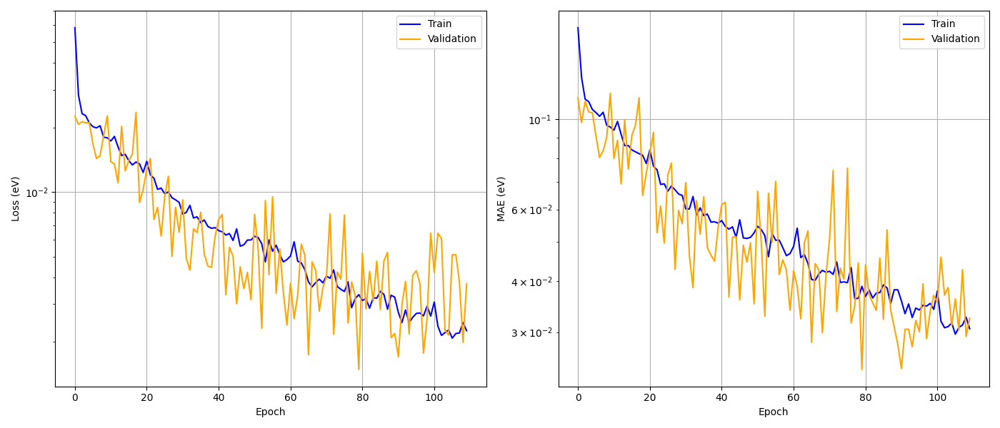
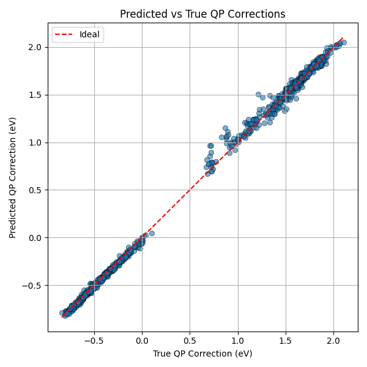

# Examples — Step-by-Step Tutorial

This tutorial walks through the complete workflow for predicting GW quasiparticle corrections with a GNN, from data collection to prediction, using monolayer MoS₂ as the example system.

A ready-to-use dataset (36 thermal snapshots of pristine 1-PC MoS₂, each with DFT + GW data) is included in `data/` so you can run steps 2–4 immediately without running GW calculations.

---

## Prerequisites

### Python environment

```bash
conda create -n gnn_env python=3.11 -y
conda activate gnn_env
pip install torch torchvision torchaudio --index-url https://download.pytorch.org/whl/cu124  # GPU
# or: pip install torch torchvision torchaudio   # CPU only
pip install torch_geometric optuna mlflow h5py ase numpy scipy matplotlib plotly
```

### Viewing MLflow results locally

```bash
mlflow ui --backend-store-uri sqlite:///mlflow.db
# Open http://127.0.0.1:5000
```

---

## Dataset description

The `data/` directory contains 36 HDF5 files, each one a thermal snapshot of the MoS₂ primitive cell (1 Mo + 2 S atoms) at the same equilibrium lattice parameters (`a = 3.12 Å`, `c = 25 Å` vacuum). Atomic positions differ across files (thermal displacements ~0.1 Å), but lattice vectors are fixed — **no strain**.

Each file contains 432 samples (one per band × k-point pair):

| Dataset | Shape | Description |
|---|---|---|
| `atom_orb_projections` | `(Nk, Nb, 3, 14)` | Orbital projections $\|\langle\phi_{Ro}\|\psi_{nk}\rangle\|^2$ |
| `Edft` | `(Nb, Nk)` | DFT eigenvalues (eV) |
| `qp_corrections` | `(Nb, Nk)` | GW corrections $\Delta E_{nk}$ (eV) |
| `atomic_positions` | `(3, 3)` | Cartesian positions (Å) |
| `lattice_vectors` | `(3, 3)` | Lattice matrix (Å) |
| `atomic_species` | `(3,)` | `['Mo', 'S', 'S']` |

Total: 36 × 432 = **15,552 training samples**.

---

## Step 0 — Collect DFT + GW data

> Skip this step if using the provided dataset.

For each structure (e.g., geometry from a thermal ensemble or MD trajectory):

### 0a. DFT calculation (Quantum ESPRESSO)

```bash
# SCF ground state
pw.x < 00_data_collection/scf.in > scf.out

# Non-self-consistent bands on the GW k-grid
pw.x < 00_data_collection/bands.in > bands.out

# Wavefunction projections onto atomic orbitals
projwfc.x < 00_data_collection/projwfc.in > projwfc.out
# Outputs: atomic_proj.xml, projwfc.out
```

See `00_data_collection/scf.in`, `bands.in`, `projwfc.in` for example inputs for MoS₂.

### 0b. GW calculation (BerkeleyGW)

```bash
# Dielectric matrix
epsilon.x < 00_data_collection/epsilon.inp > epsilon.out

# Self-energy and QP corrections
sigma.x < 00_data_collection/sigma.inp > sigma.out
# Output: eqp.dat  (columns: k-index, band-index, E_DFT, E_QP in eV)
```

### 0c. SLURM submission

```bash
sbatch 00_data_collection/job.sub
```

---

## Step 1 — Preprocessing: build HDF5 dataset

Convert the QE + BerkeleyGW outputs into an HDF5 file for the GNN.

```bash
# From the directory containing atomic_proj.xml, projwfc.out, eqp.dat, qe.in:

# 1a. Build orbital mapping (collapses symmetry-equivalent orbitals)
python ../pre_proc/map_orbitals_atoms.py \
    -projwfc_output projwfc.out
# Output: orbital_mapping.txt

# 1b. Build HDF5 dataset
python ../pre_proc/get_proj_for_graphs_and_eqp.py \
    -eqp eqp.dat \
    -Nval 13 \
    -proj_file atomic_proj.xml \
    -orbital_mapping_file orbital_mapping.txt \
    -qe_input_file qe.in \
    -output data.h5
```

See `01_preprocessing/run_local.sh` and `01_preprocessing/job.sub` for full scripts.

After processing all structures, collect the file paths into a plain text file:

```
# data_list.txt
/path/to/structure_001/data.h5
/path/to/structure_002/data.h5
...
```

---

## Step 2 — Hyperparameter optimization

Use Optuna (Bayesian TPE search) to find the best GNN architecture and training settings. Each trial trains the model for a fixed number of epochs and reports the validation MAE.

### Quick local test (~5 min on CPU)

```bash
cd examples/
bash 02_hypersearch/run_local.sh
```

### Full search on a GPU cluster

```bash
sbatch 02_hypersearch/job.sub
```

The job script runs three studies sequentially (no geometry / distances only / distances + angles) and logs all results to a single `mlflow.db`.

### Monitoring with MLflow

```bash
# After downloading mlflow.db from the cluster:
mlflow ui --backend-store-uri sqlite:///mlflow.db
```

Open [http://127.0.0.1:5000](http://127.0.0.1:5000) → click `GNN_GW_hypersearch` → you will see one row per study:

| Run | `use_distances` | `use_angles` | `best_mae` (eV) |
|---|---|---|---|
| Baseline | False | False | 0.161 |
| Dist only | True | False | 0.068 |
| Full model | True | True | **0.049** |

The **parallel coordinates chart** (Chart view in MLflow) is particularly useful for identifying which hyperparameter combinations lead to the lowest MAE.

### Key flags

| Flag | Recommended value | Description |
|---|---|---|
| `--n_trials_Bayesian_optimization` | 1000 | More trials → better optimum |
| `--total_epochs_trial` | 40 | Enough to distinguish good/bad configs |
| `--use_angles` / `--use_distances` | both True | Include geometry features |
| `--run_description` | `"Full model: dist+angles"` | Label visible in MLflow UI |

See `main/README.md` for the complete flag reference.

---

## Step 3 — Full model training

Train the model with the best hyperparameters found in Step 2, using the full dataset and early stopping.

### Locally

```bash
cd examples/
bash 03_training/run_local.sh
```

### On a cluster

```bash
sbatch 03_training/job.sub
```

### Training curves

After training, `loss_mae.png` shows the convergence of training and validation loss:



The learning rate scheduler (`ReduceLROnPlateau`) reduces the LR automatically when validation loss plateaus. Early stopping saves the weights at the best validation MAE epoch.

### Parity plot

`pred_vs_true_qp.png` shows predicted vs. reference QP corrections on the validation set:



**Results on the example dataset** (36 MoS₂ snapshots, full training):

| Metric | Value |
|---|---|
| Best validation MAE | **24.3 meV** |
| Best epoch | 80 |
| Early stopping at | epoch 110 |
| Training time (CPU) | 39 min |

For comparison, the hyperparameter search (30 epochs/trial, 1 file) found a best MAE of 48.6 meV — full training on all data roughly halves the error.

### MLflow tracking

Each training run logs per-epoch curves to MLflow. After copying `mlflow.db` back locally:

```bash
mlflow ui --backend-store-uri sqlite:///mlflow.db
```

Click `GNN_GW_training` → select a run → **Metrics** tab → click `val_mae` to see the learning curve interactively.

---

## Step 4 — Prediction on new structures

Apply the trained model to new DFT structures (e.g., a defect supercell or a strained structure). The model only requires the same DFT inputs used for training — no new GW calculation needed.

### Preprocessing new structures

Run Steps 0 and 1 for the new structures (DFT + projwfc only, BerkeleyGW not required). Set `-dont_use_eqp True` in `get_proj_for_graphs_and_eqp.py` to skip the `eqp.dat` step:

```bash
python ../pre_proc/get_proj_for_graphs_and_eqp.py \
    -proj_file atomic_proj.xml \
    -orbital_mapping_file orbital_mapping.txt \
    -qe_input_file qe.in \
    -output new_structure.h5 \
    -dont_use_eqp True
```

### Running prediction

```bash
cd examples/
bash 04_prediction/run_local.sh
```

Or on a cluster:

```bash
sbatch 04_prediction/job.sub
```

### Outputs

| File | Description |
|---|---|
| `predictions.npz` | NumPy archive with `y_pred` and `y_true` arrays (eV) |
| `eqp_from_GNN.dat` | Two-column text: `Edft  Eqp_GNN` (eV), one row per state $(n,k)$. Drop-in replacement for BerkeleyGW's `eqp.dat` |

---

## Directory structure

```
examples/
├── README.md                        ← this file
├── figures/
│   ├── loss_mae.png                 ← training curves
│   └── pred_vs_true_qp.png          ← parity plot
├── data/
│   ├── data_for_GNN.h5_0 … h5_25   ← 36 MoS2 thermal snapshots
│   ├── data_list.txt                ← all 36 files (full training)
│   └── data_list_opt_study.txt      ← 1 file (hyperparameter search)
├── 00_data_collection/
│   ├── scf.in                       ← QE SCF input (MoS2 template)
│   ├── bands.in                     ← QE bands input
│   ├── projwfc.in                   ← projwfc.x input
│   ├── epsilon.inp                  ← BerkeleyGW epsilon input
│   ├── sigma.inp                    ← BerkeleyGW sigma input
│   ├── run_local.sh                 ← local bash script
│   └── job.sub                      ← SLURM submission script
├── 01_preprocessing/
│   ├── run_local.sh
│   └── job.sub
├── 02_hypersearch/
│   ├── run_local.sh                 ← quick 20-trial test
│   └── job.sub                      ← full 1000-trial GPU job (3 studies)
├── 03_training/
│   ├── best_params.json             ← example best hyperparameters
│   ├── run_local.sh
│   └── job.sub
└── 04_prediction/
    ├── run_local.sh
    └── job.sub
```

---

## Tips

- **Start with `02_hypersearch/run_local.sh`** (20 trials, ~5 min) to verify your environment is set up correctly before submitting the full cluster job.
- **All MLflow results go to a single `mlflow.db`** in the directory where you run the scripts. Copy it to your laptop to view results with `mlflow ui`.
- **`eqp_from_GNN.dat`** uses the same two-column format as BerkeleyGW's `eqp.dat`, so it can be fed directly into BSE calculations that read QP-corrected energies.
- **Transferability**: this example model is trained on pristine MoS₂. Applying it to vacancy supercells or other materials is an extrapolation — expect reduced accuracy until those systems are included in the training set.
